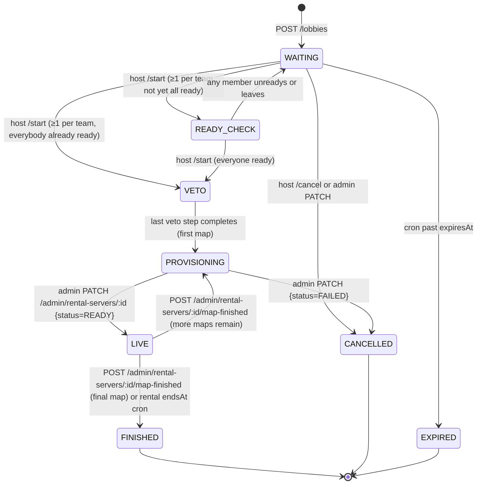

# Lobbies + Rental Servers

This document covers the player-facing "Rent a server" flow: lobbies, captains, veto, and provisioning. For machine-readable request/response shapes and copy-paste examples see [`postman.collection.json`](postman.collection.json).

## State machine



### Invariants

- A user can host at most one active (non-terminal) lobby.
- A user can be an active member of at most one lobby; `POST /lobbies/:id/join` auto-removes the caller from any other `WAITING` lobby.
- `teamSize = 5` caps how many players can sit on each team when joining; `/start` only requires at least one active player on Team A and on Team B (e.g. 1v1 through 5v5).
- Host leaving transfers ownership to the longest-tenured captain (Team A first, then Team B); with no captain the lobby is CANCELLED.
- Only the HOST can `/kick`, `/move`, `/start`, `/cancel`, or rotate invites.
- Only the team's CAPTAIN (or the HOST for Team A) can submit `/veto/ban`, `/veto/pick`, `/veto/side`. Team B captain is the first non-spectator to join Team B; the HOST can reassign via `/move { promoteCaptain: true }`.
- Entering `VETO` (host `POST /lobbies/:id/start` with every A/B member ready) creates a `matches` row: `lobbyId` set, `lobby.matchId` updated, `Match.status = VETO_PHASE`, `mapName` null until veto finishes. Veto completion updates that same row to `CONFIGURING_SERVER` and fills map / veto fields, then creates the rental server.
- Map series are provisioned **one map at a time**. Veto completion emits `LOBBY_PROVISIONING_REQUESTED` with only `mapName = vetoSeriesMaps[0]` and `seriesMapIndex = 0`. When the external backend reports the map finished via `POST /admin/rental-servers/:id/map-finished`, the rental is wiped, `lobby.seriesMapIndex` is bumped, and the event is re-emitted for the next map. After the last map the lobby moves to `FINISHED` and the linked match is marked `FINISHED`.

## Endpoints

All routes are prefixed with `/api` and require `Authorization: Bearer <JWT>` unless noted. Admin routes additionally require an admin JWT (`isAdmin = true` in the user record).

Player / member routes (in [`src/lobbies/lobbies.controller.ts`](src/lobbies/lobbies.controller.ts)):

| Method | Path | Purpose | Auth |
| ------ | ---- | ------- | ---- |
| POST   | `/lobbies` | Create a Bo3/Bo5 lobby (throttled 5/h, 20/day per user) | JWT |
| GET    | `/lobbies/options` | Region/feature/mode enumeration for the rent form | JWT |
| GET    | `/lobbies/mine` | All active lobbies the caller belongs to | JWT |
| GET    | `/lobbies/by-code/:inviteCode` | Resolve invite code | JWT |
| GET    | `/lobbies/:id` | Full LobbyView (must be member or admin) | JWT |
| POST   | `/lobbies/:id/join?team=A\|B` | Join | JWT |
| POST   | `/lobbies/:id/leave` | Leave | JWT |
| POST   | `/lobbies/:id/kick` | `{ userId }` | JWT (host) |
| POST   | `/lobbies/:id/move` | `{ userId, team, promoteCaptain? }` | JWT (host) |
| POST   | `/lobbies/:id/ready` | `{ ready: boolean }` | JWT (member) |
| POST   | `/lobbies/:id/start` | Advance to READY_CHECK or VETO | JWT (host) |
| POST   | `/lobbies/:id/cancel` | Cancel lobby | JWT (host) |
| POST   | `/lobbies/:id/invites` | Rotate invite code | JWT (host) |
| POST   | `/lobbies/:id/veto/ban` | `{ map }` | JWT (captain) |
| POST   | `/lobbies/:id/veto/pick` | `{ map }` | JWT (captain) |
| POST   | `/lobbies/:id/veto/side` | `{ side: 'ct'\|'t' }` | JWT (captain) |
| POST   | `/lobbies/tournament-inquiry` | Tournament inquiry (throttled 3/h) | JWT |

Admin routes (in [`src/lobbies/admin-lobbies.controller.ts`](src/lobbies/admin-lobbies.controller.ts)):

| Method | Path | Purpose |
| ------ | ---- | ------- |
| GET    | `/admin/lobbies?status=&hostUserId=&limit=&offset=` | List/filter lobbies |
| PATCH  | `/admin/lobbies/:id` | `{ status?, reason? }` — override / force-cancel |
| GET    | `/admin/rental-servers` | List rental servers |
| PATCH  | `/admin/rental-servers/:id` | `{ host?, port?, gotvPort?, endsAt?, status?, reason? }` |
| POST   | `/admin/rental-servers/:id/map-finished` | `{ reason? }` — called by external provisioner when the current map ends; advances the BO3/BO5 series or finishes the lobby |

## Realtime events (Socket.IO, `/veto` namespace)

Clients authenticate on the existing `/veto` namespace (JWT via `auth.token` or `Authorization` header) and join `lobby:<lobbyId>` rooms via:

```json
// outbound
{ "event": "subscribe_lobby", "data": { "lobbyId": "..." } }
{ "event": "unsubscribe_lobby", "data": { "lobbyId": "..." } }
```

Server validates membership (`LobbyMembershipResolver.isMemberBySteamId`) before joining the room; non-members receive `{ ok: false, error: "forbidden" }`.

| Event | Payload |
| ----- | ------- |
| `lobby.updated` | Full `LobbyView` (each `members[]` entry includes `steamId`) |
| `lobby.member.joined` | `{ member: LobbyMemberView }` |
| `lobby.member.left` | `{ userId, reason: 'left' \| 'kicked' \| 'host_transfer' }` |
| `lobby.member.kicked` | `{ userId, byUserId }` |
| `lobby.member.readyChanged` | `{ userId, isReady }` |
| `lobby.member.teamChanged` | `{ userId, team, role }` |
| `lobby.status.changed` | `{ from, to }` |
| `lobby.veto.started` | `{ format: 'bo3' \| 'bo5', mapPool, firstActor: { team } }` |
| `lobby.veto.stepApplied` | `{ step: { kind, side: 'A' \| 'B' }, bans, picks, pickSides }` |
| `lobby.veto.completed` | `{ seriesMaps }` |
| `lobby.server.ready` | `{ host, port, gotvPort, connectString, endsAt, map, seriesMapIndex }` — **members only** |
| `lobby.map.finished` | `{ seriesMapIndex, map, reason }` — current map ended |
| `lobby.map.advanced` | `{ seriesMapIndex, map }` — series advanced to next map, provisioning again |
| `lobby.cancelled` | `{ reason }` |

`lobby.server.ready` is emitted only to sockets in the room whose authenticated Steam id is a current lobby member. Other events broadcast to the whole `lobby:<lobbyId>` room.

## connectString format

See [`src/lobbies/connect-string.ts`](src/lobbies/connect-string.ts).

- With password: `password <serverPassword>; connect <host>:<port>`
- Without password: `connect <host>:<port>`

GOTV is surfaced via the `gotvPort` field; the frontend renders a separate `connect <host>:<gotvPort>` hint when `features.cstv = true`.

## Reconciling half-committed provisioning rows

When the CS2 orchestrator's `POST /api/start` returns a `gamePort`, the backend promotes the match to `LIVE` and persists the rental (status `READY`, host/port/connectString) in one step before broadcasting `lobby.server.ready`. Historically a broadcast-layer bug could throw between the `matches` save and the rental save, leaving the DB in an inconsistent state:

- `matches` row: `status = LIVE`, `gameServerHost`/`gamePort`/`tvPort`/`connectCommand` populated.
- `rental_servers` row: still `status = PROVISIONING`, `host`/`port`/`connectString` null.
- Clients never received `lobby.server.ready`.

The current code (see [`src/lobbies/lobby-provisioning.service.ts`](src/lobbies/lobby-provisioning.service.ts)) saves the rental before any socket emits and wraps emits in `safeEmit`, so future socket failures can no longer corrupt persisted state. For any lobbies that are already stuck in this shape (match is `LIVE`, rental is `PROVISIONING` with nulls), an operator can reconcile by calling:

```http
PATCH /api/admin/rental-servers/:id
Content-Type: application/json

{ "status": "READY", "host": "<game host>", "port": <gamePort>, "gotvPort": <tvPort> }
```

`applyAdminUpdate` will rebuild `connectString`, set `startedAt`, keep the already-LIVE match untouched, and re-broadcast `lobby.server.ready` to every member currently connected to the `/veto` namespace room.

## Lifecycle / cron

[`LobbyLifecycleScheduler`](src/lobbies/lobby-lifecycle.scheduler.ts) runs every 5 minutes:

- `WAITING` lobbies past `expiresAt` → `EXPIRED` (+ members `leftAt`).
- `READY`/`ACTIVE` rental servers past `endsAt` → `EXPIRED`; owning lobby `LIVE → FINISHED`.
- `CANCELLED`/`FINISHED`/`EXPIRED` lobbies older than `LOBBY_CLEANUP_AGE_DAYS` (default 30) are soft-deleted (`deletedAt`).

Environment knobs (see [`src/config/env.validation.ts`](src/config/env.validation.ts)): `LOBBY_TTL_MINUTES`, `LOBBY_DEFAULT_DURATION_MINUTES`, `LOBBY_CREATE_LIMIT_PER_HOUR`, `LOBBY_CREATE_LIMIT_PER_DAY`, `LOBBY_INQUIRY_LIMIT_PER_HOUR`, `LOBBY_CLEANUP_AGE_DAYS`.

## Veto formats

`mapVetoStepsForFormat(format)` in [`src/matches/map-veto-sequence.ts`](src/matches/map-veto-sequence.ts):

- `bo1` — tournament Swiss: 6 alternating bans + decider.
- `bo3` — 2 bans, 2 picks (+sides), 2 bans + decider.
- `bo5` — lobby rentals: 2 bans, 4 picks (+sides) → decider.

Lobby Bo3 uses the same step sequence as tournament Bo3, so the frontend's veto UI is already compatible.

## Tournament inquiry

`POST /lobbies/tournament-inquiry` writes a `TournamentInquiry` row and responds `202 { id, receivedAt }`. The collection of inquiries is visible to admins via any admin user CRUD tooling — we deliberately do not expose a public read endpoint.
